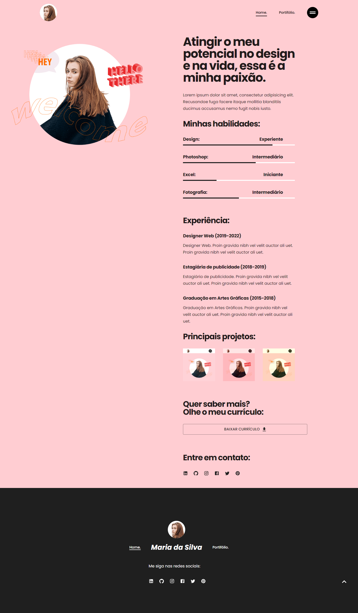
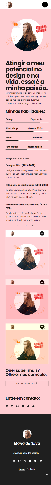

# Portifólio Pessoal

<!---Esses são exemplos. Veja https://shields.io para outras pessoas ou para personalizar este conjunto de escudos. Você pode querer incluir dependências, status do projeto e informações de licença aqui--->


> [Portifólio Visualização ao Vivo](https://tiny-macaron-3edcdf.netlify.app)

> Template de portifólio pessoal.

## 💻 Versão computador



## 💻 Versão celular



## 💻 Pré-requisitos

Antes de começar, verifique se você atendeu aos seguintes requisitos:

- Você instalou a versão mais recente do `NodeJs/NPM`
- Você tem uma máquina `Windows/Linux/Mac`.

## 🚀 Para iniciar o template

Para iniciar o Portfólio, siga estas etapas:

- Descompacte a pasta com os arquivos.

- Entre na pasta usando o cmd.

- Rode o comando 'npm install' para instalar as dependências.

- Inicie o projeto com o comando 'npm run start'.

```
cd ./portfolio

npm install

npm run start
```

## 🤝 Contributors

Agradecemos as seguintes pessoas que contribuíram para este projeto:

<table>
  <tr>
    <td align="center">
      <a href="#">
        <br>
        <sub>
          <b>Leonardo Rebouças</b>
        </sub>
      </a>
    </td>
  </tr>
</table>

## 📝 License

Este projeto está sob licença. Veja a [Licença](LICENSE.md) para mais detalhes.

© 2022 GitHub, Inc.
Terms
Privacy
Security
Status
Docs
Contact GitHub
Pricing
API
Training
Blog
About
